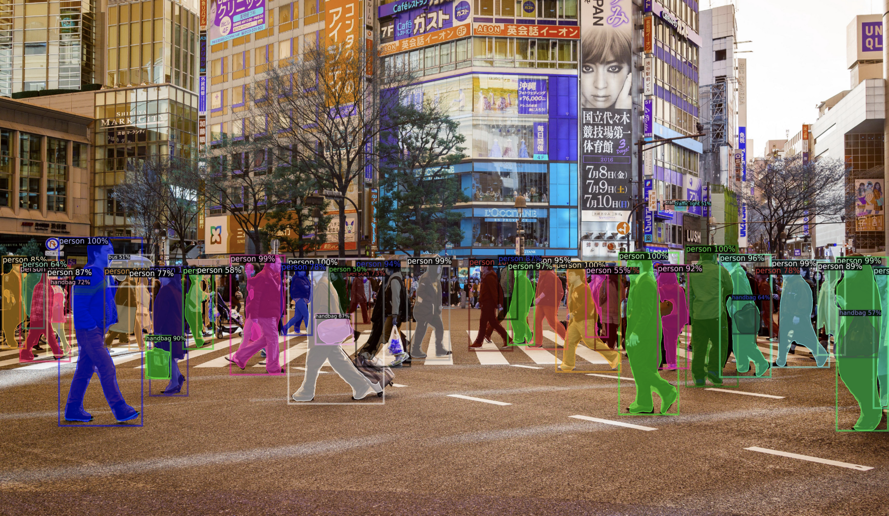

# d2-camera
Real-time object detection and segmentation using Facebook Detectron2 library.

# Installation

1. Git clone the repo
2. Run python setup.py install
3. Install [detectron2](https://detectron2.readthedocs.io/en/latest/tutorials/install.html)

# Running Application
* Type *d2* to start the application
* Type *q* to quit the application

Read the [Medium article](https://alpha2phi.medium.com/object-detection-and-segmentation-using-detectron2-ac5bce45a391) for more details!

